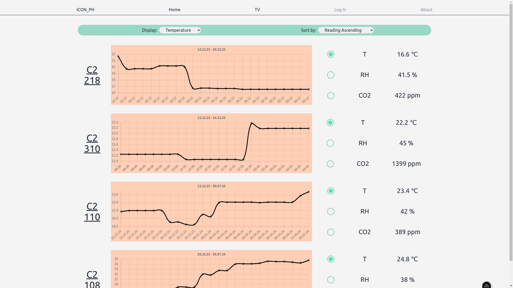
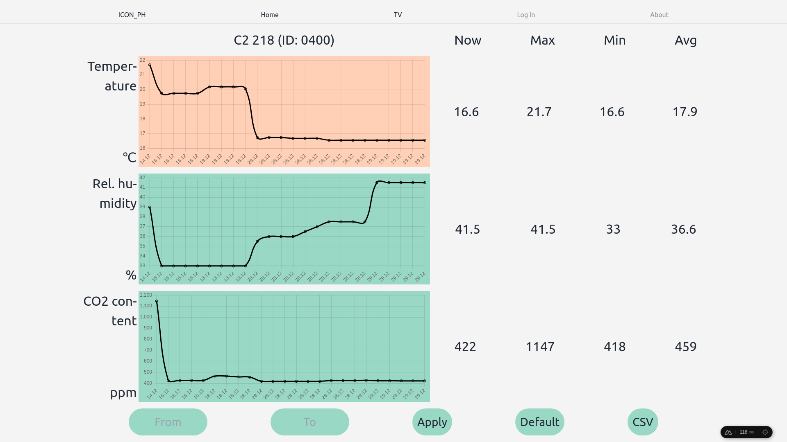
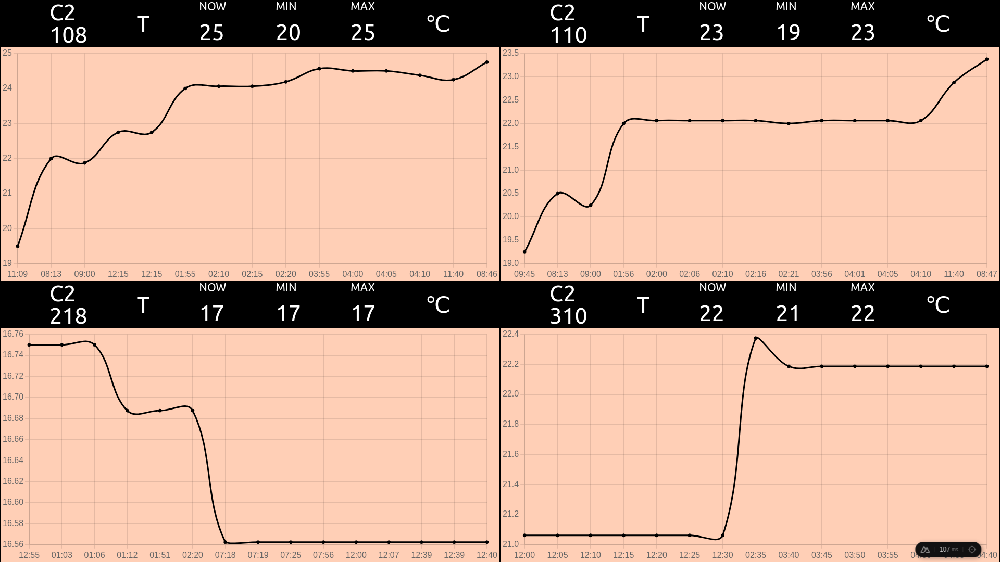
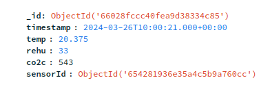
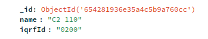

GH readme
========================

# AiRQuality - Monitor air quality parameters through an array of IQRF sensors
This project was created as a BSc thesis at the Wrocław University of Science and Technology.
The system of the application consists of 2 main parts:
1. a network of IQRF sensors collecting data on temperature, humidity and CO2 content in air
2. a single-page web application allowing the monitoring of current and historical sensor data, which is the focus of this README

This project is in late stages of development as of writing this document - changes will occur

# Techstack

The webapp portion of the project is an application based on the *Nuxt* framework (Vue + Nitro + Vite) configured to run *Typescript*. A simple database was created using *MongoDB* as its platform. The connection between the database and the backend was established through the use of *Prisma ORM*.

The UI portion of the app heavily relies on *Tailwind* for its micro utility classes. A UI component library, *PrimeVue*, was also used for some of its interactive components (DatePicker, Drawer).

# Views
AiRQ consists of just 3 views:
1. The general view allowing monitoring of all available sensors at once (a quick-glance view)
2. The details view allowing more detailed supervision of the sensors, such as time period selection or download of data in CSV format
3. The presentation view, devoid of interactive elements which is intended for displaying general readings over longer periods of time - picture a TV on the wall running for most of the day for passersby to look at.
All views were made dynamic to accommodate different display shapes and sizes, including mobile.

## General View

## Details View

## Presentation View

# Backend
Since the "pages/" directory structure is directly and automatically mapped by Nuxt into routes (a neat feature of this framework), the explicit backend portion of the app is limited to a single plugin that collects data from the IQRF Cloud server, filters and formats that data and saves it to the database. 

IQRF Cloud is an external service provided by *IQRF Tech s.r.o.*. This service directly communicates with the network of sensors and the backend of this application serving as the middleman.

The database server is hosted on MongoDB Atlas, mostly due to technical limitations but also for the advantage of build-in remote database access and nice GUI. 

# Database
Given the low complexity of collected data, the database schema is also rather simple and consists of just two collections: a collection of registered sensors and a collection of readings collected from those sensors

# Deployment 
The system was deployed on university grounds to monitor 4 specific classrooms, while the application itself was set to run as a dockerized process on a 4GB RaspberryPi. This server was then externalized only to the local network is was directly connected to, as per project specification.

